# The Rise of Declarative Data Processing: Past, Present, and Future  

## Introduction  
In the ever-expanding world of data engineering, one paradigm has consistently shaped how we think about data transformations and analytics: **declarative data processing**. Instead of focusing on *how* to execute a task step-by-step, declarative systems allow users to specify *what* they want as the end result, leaving the execution details to the underlying engine.  

This paradigm has revolutionized data processing frameworks, from traditional SQL databases to modern big data platforms like Apache Spark, Databricks, and dbt. But to appreciate where we are today, let’s trace the **origins, evolution, and future** of declarative frameworks.  

---

## Origins of Declarative Frameworks  
The roots of declarative data processing go back to **SQL (Structured Query Language)** in the 1970s. Developed by Donald D. Chamberlin and Raymond F. Boyce at IBM, SQL was built on top of the relational model proposed by Edgar F. Codd.  

Unlike procedural languages, SQL was declarative:
- You don’t write loops or step-by-step instructions.  
- You *declare* what data you want (e.g., `SELECT name FROM customers WHERE age > 30;`).  
- The query optimizer decides how to fetch it efficiently.  

This separation between intent (*what*) and execution (*how*) made SQL extremely powerful and enduring—it’s still the dominant interface for querying data decades later.  

---

## The Evolution of Declarative Data Processing  

```mermaid
timeline
    title Declarative Data Processing Evolution
    1970s : Birth of SQL : Relational model by Codd → SQL by Chamberlin & Boyce
    1990s : Databases Mature : Oracle, MySQL, PostgreSQL widely adopt SQL
    2000s : Big Data : Hadoop MapReduce (procedural), then Hive & Pig bring declarative SQL-like abstractions
    2014 : Spark SQL : Declarative APIs + Catalyst Optimizer
    2015+ : Cloud Warehouses : Snowflake, BigQuery, Redshift — SQL-first
    2016+ : Analytics Engineering : dbt enables SQL-based transformations
    2021+ : Lakehouse Era : Databricks Delta Live Tables (DLT) brings declarative pipelines
    Future : AI + Declarative : Natural language → SQL, unified batch/stream, automated optimization
```

---

## Why Declarative?  
Declarative systems are thriving because they bring several advantages:  
1. **Simplicity** – Engineers describe *what* they want, not the algorithm.  
2. **Optimization** – Engines can optimize execution automatically (parallelism, indexes, caching).  
3. **Portability** – Declarative code is abstract; execution can adapt to hardware and platform improvements without user changes.  
4. **Maintainability** – Pipelines are easier to reason about, test, and evolve.  

---

## The Current Landscape  
Today, declarative frameworks span across the data stack:  

- **Data Warehouses:** Snowflake, BigQuery, Redshift (SQL-driven).  
- **Data Lakes & Lakehouses:** Databricks Delta Live Tables, Apache Iceberg with SQL engines.  
- **Data Transformation:** dbt, SQLMesh, Dataform.  
- **Stream Processing:** Apache Flink SQL, ksqlDB (Kafka SQL).  
- **Workflow Orchestration:** Prefect and Dagster increasingly adopt declarative configuration for tasks.  

Declarative approaches are no longer limited to queries—they now drive **pipelines, orchestration, and governance**.  

---

## The Future of Declarative Data Processing  

The journey is far from over. Here’s what the next wave may look like:  

1. **AI-Augmented Declarative Systems**  
   - LLMs will help translate natural language into declarative queries and transformations.  
   - Query optimization will become adaptive, learning from workload patterns.  

2. **Unified Declarative Layer**  
   - Convergence of SQL for batch + stream (already seen in Flink, Beam, Databricks).  
   - A single declarative interface to govern structured, semi-structured, and unstructured data.  

3. **Declarative + Observability**  
   - Frameworks will automatically embed **data quality checks** and lineage tracking into declarative pipelines.  
   - Expectations (like in Great Expectations) will become declarative clauses, integrated directly into SQL or pipeline definitions.  

4. **Declarative Data Products**  
   - The Data Mesh paradigm envisions data as products, and these will likely be described and deployed declaratively.  

5. **End-to-End Declarativity**  
   - From ingestion → transformation → ML training → deployment → monitoring—all expressed declaratively, with procedural code only for niche custom logic.  

---

## Conclusion  
From the **birth of SQL** in the 1970s to **modern lakehouse pipelines**, declarative data processing has consistently proven itself as the most scalable, maintainable, and user-friendly paradigm.  

We’ve moved from hand-coded MapReduce to **SQL-powered big data engines**, and today to **fully declarative pipelines with dbt and Databricks DLT**. Tomorrow, we may see **AI-driven, self-optimizing, end-to-end declarative data platforms**.  

One thing is clear:  
**Declarativity is not just a feature—it’s the backbone of data processing past, present, and future.**  